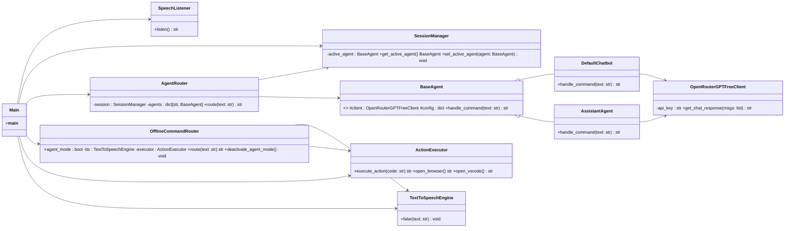
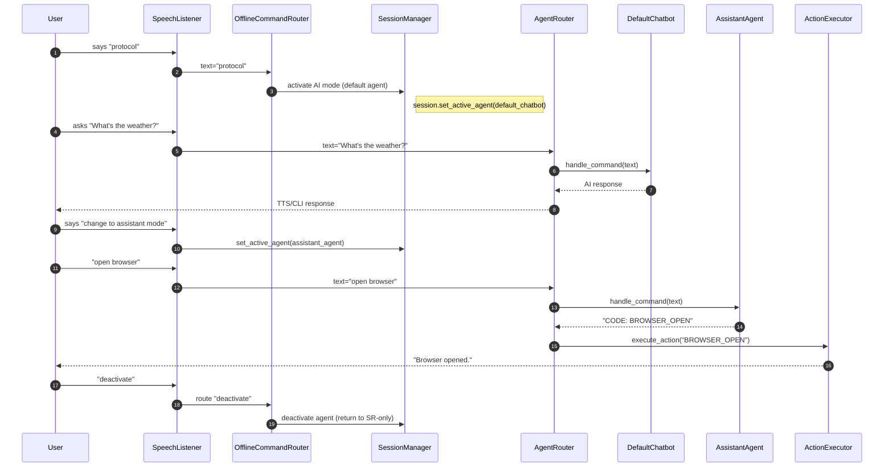

````markdown
# 🤖 Genesis Core – Modular AI Voice Assistant

Genesis Core is a modular, intelligent voice assistant designed for automation and voice interaction with multiple AI agents.  
It uses **Google Speech Recognition** for speech-to-text, meaning that **transcriptions are sent to external servers even before activating AI mode**.

---

## 📌 Table of Contents
- [Project Vision and Scope](#-project-vision-and-scope)
- [Software Requirements](#-software-requirements)
- [System Design](#-system-design)
- [Libraries and Versioning](#-libraries-and-versioning)
- [Installation](#-installation)
- [Usage](#-usage)
- [Contribution Guide](#-contribution-guide)
- [License](#-license)

---

## 🎯 Project Vision and Scope

### Context
Genesis Core starts with Google SR active to transcribe voice into text. After the activation command (`protocol`), the system routes all recognized text to the active AI agent (e.g., `default_chatbot`).

### Users
- Home users interested in voice automation.
- Technical professionals integrating voice AI into workflows.
- Developers building new agents and commands.

### Assumptions
- Python 3.11+
- Functional microphone and speakers
- Activation command set in `prompts.yaml`
- Environment variable `OPENROUTER_API_KEY` set
- Internet connection required for speech transcription

---

## 🛠 Software Requirements

### Functional Requirements
- Always start with Google SR active.
- Execute local commands even without AI active.
- Activate/deactivate AI via configurable voice commands.
- Switch between AI agents without restarting.
- Respond via voice and text.

### Non-Functional Requirements
- Google SR requires internet.
- Agent switching is immediate.
- YAML stores agent and command configuration.
- Minimal CPU usage outside AI calls.

---

## 🖥 System Design

### Directory Structure
```text
src/
├── main.py
├── core/
│   ├── speech_listener.py
│   ├── session_manager.py
│   ├── agents_router.py
│   ├── offline_command_router.py
│   ├── action_executor.py
├── agents/
│   ├── default_chatbot.py
│   ├── assistant_agent.py
├── services/
│   ├── openai_client.py
│   ├── tts_engine.py
├── config/
│   └── prompts.yaml
````

---

### Class Diagram



---

### Flow Diagram



---

## 📦 Libraries and Versioning

| Library              | Version | Purpose                      |
| -------------------- | ------- | ---------------------------- |
| `SpeechRecognition`  | 3.10.0  | Google SR speech recognition |
| `pyttsx3`            | 2.90    | Offline text-to-speech       |
| `PyYAML`             | 6.0.1   | YAML configuration handling  |
| `httpx`              | 0.27.0  | API HTTP client              |
| `pyaudio`            | 0.2.13  | Microphone audio capture     |
| `python-dotenv`      | 1.0.0   | Load environment variables   |
| `os` (built-in)      | -       | OS operations                |
| `pathlib` (built-in) | -       | Cross-platform path handling |

> **Privacy Notice:** Since Google Speech Recognition is used, audio (or transcriptions) are sent to external servers for text conversion — this happens from the moment the system is initialized.

---

## ⚙ Installation

### 1. Clone the repository

```bash
git clone https://github.com/yourusername/genesis-core.git
cd genesis-core
```

### 2. Create and activate a virtual environment

```bash
python -m venv venv
source venv/bin/activate     # Linux/Mac
venv\Scripts\activate        # Windows
```

### 3. Install dependencies

```bash
pip install -r requirements.txt
```

### 4. Set your API key

```bash
# Windows (CMD)
set OPENROUTER_API_KEY=your_key_here

# Windows (PowerShell)
$env:OPENROUTER_API_KEY="your_key_here"

# Linux/Mac
export OPENROUTER_API_KEY="your_key_here"
```

---

## 🚀 Usage

Run the assistant:

```bash
python main.py
```

### Basic voice commands:

* `"protocol"` → activate AI mode (default agent)
* `"change to assistant mode"` → switch to Assistant Agent
* `"exit"` or `"deactivate"` → disable AI mode
* Local commands like `"open browser"` available in all modes

---

## 🤝 Contribution Guide

We welcome contributions!
To contribute:

1. Fork the repository
2. Create a new branch:

   ```bash
   git checkout -b feature/my-feature
   ```
3. Commit your changes:

   ```bash
   git commit -m "Add my feature"
   ```
4. Push and submit a Pull Request

For major changes, please open an issue to discuss before starting development.

---

## 📜 License

This project is licensed under the MIT License.
See the [LICENSE](LICENSE) file for details.

