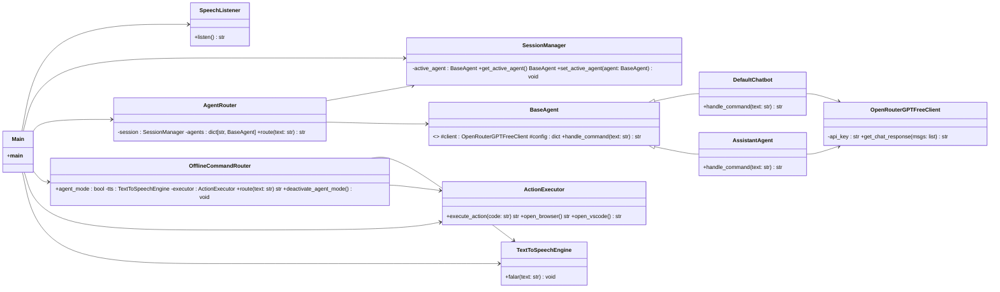
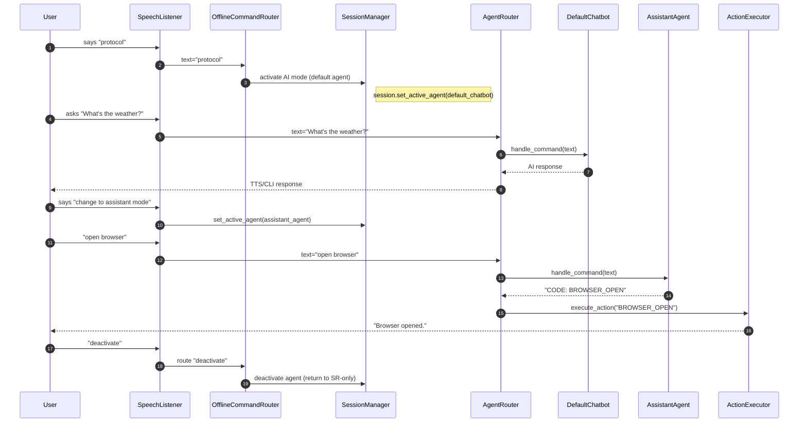

# 📘 Technical Documentation – Genesis Core (with diagrams)

---

## 🧭 Table of Contents

- 1. Project Vision and Scope
        
- 2. Software Requirements
        
- 3. System Design
        
- 4. Libraries and Versioning
        

---

# 1. Project Vision and Scope

## 1.1. Problem Description

### 1.1.1. Project Context

Genesis Core is a modular and intelligent voice assistant designed to provide automation and voice interaction with multiple AI agents. Upon startup, it already uses **Google Speech Recognition** to transcribe the user's speech into text, which means that **even before activating AI mode, transcriptions are sent to external servers** for processing. After the activation command ("protocol"), the user's input is forwarded to the active AI agent (e.g., `default_chatbot`).

### 1.1.2. Stakeholders

- **End User:** People who want to automate tasks via voice.
    
- **Developer:** Professional maintaining, adapting, or expanding the system with new agents and commands.
    
- **AI & SR Provider:** API providers for natural language interpretation and speech recognition (e.g., OpenRouter/OpenAI, Google Speech Recognition).
    

### 1.1.3. Users

- Home users interested in voice automation.
    
- Technical professionals integrating Genesis Core into their workflow.
    
- Developers creating new agents or custom commands.
    

### 1.1.4. Assumptions

- Python 3.11 or higher.
    
- Functional microphone and audio output.
    
- Activation command configured in `prompts.yaml`.
    
- External API key set in `OPENROUTER_API_KEY` environment variable.
    
- Internet connection required for speech transcription (mandatory).
    

---

## 1.2. Solution Vision

### 1.2.1. Vision Statement

Build a flexible, modular, and extensible voice assistant with multiple AI behaviors, voice activation, and the ability to execute local commands.

### 1.2.2. System Usage Scenarios

- **Initial mode (active listening with SR):** Captures voice and sends it to Google SR, interpreting predefined local commands.
    
- **AI Mode Activation:** Saying "protocol" activates the `default_chatbot` agent and sends inputs to the configured AI.
    
- **Agent Switching:** Saying "change to assistant mode" switches the agent to `assistant_agent`.
    
- **AI Deactivation:** Saying "exit" or "deactivate" returns the system to the SR-only listening state.
    

### 1.2.3. Product Features

- Speech recognition via Google SR.
    
- Multiple AI agents with distinct behaviors.
    
- Commands and prompts configurable via YAML.
    
- Execution of local commands in any state.
    
- Text (CLI) and voice (`pyttsx3`) responses.
    

---

# 2. Software Requirements

## 2.1. Use Cases

### UC01 – Start Assistant with SR

**Description:** On startup, the system uses Google SR to transcribe voice and interpret local commands.  
**Flow:**

1. User starts the system.
    
2. `SpeechListener` sends audio to Google SR.
    
3. Textual response is processed by `OfflineCommandRouter`.
    

### UC02 – Activate AI Mode

**Description:** Saying "protocol" activates the default agent (`default_chatbot`).  
**Flow:**

1. SR recognizes "protocol".
    
2. `SessionManager` switches to AI mode.
    
3. `AgentRouter` forwards inputs to AI.
    

### UC03 – Switch Agent

**Description:** Saying "change to assistant mode" switches the active behavior.  
**Flow:**

1. SR recognizes the switch command.
    
2. `SessionManager` activates `assistant_agent`.
    

### UC04 – Execute Local Command

**Description:** Commands like "open browser" are recognized and executed via `ActionExecutor` in any mode.

### UC05 – Deactivate AI

**Description:** Saying "exit" or "deactivate" returns the system to the initial SR-only state.

---

## 2.2. Functional Requirements

- **FR01:** Always start with Google SR active.
    
- **FR02:** Execute local commands even without AI active.
    
- **FR03:** Activate/deactivate AI via configurable voice commands.
    
- **FR04:** Switch between AI agents without restarting the system.
    
- **FR05:** Respond via both voice and text.
    

## 2.3. Non-Functional Requirements

- **NFR01:** Google SR requires an internet connection.
    
- **NFR02:** Agent switching must be immediate.
    
- **NFR03:** YAML centralizes agent and command configuration.
    
- **NFR04:** Minimal CPU usage outside AI calls.
    

---

## 2.4. Prototypes

### 2.4.1. CLI Interface

- Terminal displays logs and text responses.
    
- Synthesized voice accompanies responses.
    

### 2.4.2. Navigation Model

```text
[SR Active]
   ↓ "protocol"
[AI Mode - default_chatbot]
   ↓ "change to assistant mode"
[AI Mode - assistant_agent]
   ↓ "deactivate"
[SR Active]
```

---

# 3. System Design

## 3.1. Structure

```text
src/
├── main.py
├── core/
│   ├── speech_listener.py
│   ├── session_manager.py
│   ├── agents_router.py
│   ├── offline_command_router.py
│   ├── action_executor.py
├── agents/
│   ├── default_chatbot.py
│   ├── assistant_agent.py
├── services/
│   ├── openai_client.py
│   ├── tts_engine.py
├── config/
│   └── prompts.yaml
```

## 3.2. Main Components

- **SpeechListener:** Captures voice and sends it to Google SR.
    
- **SessionManager:** Controls the active agent and AI state.
    
- **AgentRouter:** Routes input to the active agent.
    
- **OfflineCommandRouter:** Recognizes local commands.
    
- **ActionExecutor:** Executes OS actions.
    
- **Agents:** Define behaviors and prompts.
    
- **OpenRouterClient:** Sends prompts to AI.
    
- **tts_engine.py:** Voice responses via `pyttsx3`.
    

## 3.3. Diagrams (Mermaid)

### 3.3.1. Class Diagram



### 3.3.2. Flow Diagram (Activation, Agent Switch, and Execution)



---

# 4. Libraries and Versioning

| Library              | Recommended Version | Purpose                          |
| -------------------- | ------------------- | -------------------------------- |
| `SpeechRecognition`  | 3.10.0              | Speech recognition via Google SR |
| `pyttsx3`            | 2.90                | Offline text-to-speech synthesis |
| `PyYAML`             | 6.0.1               | Read YAML configuration files    |
| `httpx`              | 0.27.0              | HTTP client for API calls        |
| `pyaudio`            | 0.2.13              | Capture microphone audio         |
| `python-dotenv`      | 1.0.0               | Load environment variables       |
| `os` (built-in)      | -                   | System operations                |
| `pathlib` (built-in) | -                   | Cross-platform path handling     |

> **Privacy:** Since Google Speech Recognition is used, audio (or transcription) is sent to external servers for text conversion — this occurs from the moment the system is initialized.

---
