# 📘 Documentação Técnica – Genesis Core (com diagramas)

---

## 🧭 Sumário

- 1. Visão e Escopo do Projeto
        
- 2. Requisitos de Software
        
- 3. Projeto do Sistema
        
- 4. Bibliotecas e Versionamento
        

---

# 1. Visão e Escopo do Projeto

## 1.1. Descrição do problema

### 1.1.1. Contexto do projeto

O Genesis Core é um assistente de voz modular e inteligente, desenvolvido para oferecer automação e interação por voz com múltiplos agentes de IA. Ao iniciar, ele já utiliza o serviço de **Speech Recognition do Google** para transcrever a fala do usuário em texto, o que significa que **mesmo antes da ativação do modo IA, as transcrições são enviadas a servidores externos** para processamento. Após o comando de ativação ("protocol"), a entrada do usuário passa a ser encaminhada para o agente de IA ativo (ex.: `default_chatbot`).

### 1.1.2. Stakeholders

- **Usuário final:** Pessoas que desejam automatizar tarefas por voz.
    
- **Desenvolvedor:** Profissional que mantém, adapta ou expande o sistema com novos agentes e comandos.
    
- **Fornecedor de IA e SR:** Provedores de APIs para interpretação de linguagem natural e reconhecimento de voz (ex.: OpenRouter/OpenAI, Google Speech Recognition).
    

### 1.1.3. Usuários

- Usuários domésticos interessados em automação por voz.
    
- Profissionais técnicos que desejam integrar o Genesis Core ao fluxo de trabalho.
    
- Desenvolvedores que desejam criar novos agentes ou comandos personalizados.
    

### 1.1.4. Premissas

- Python 3.11 ou superior.
    
- Microfone e saída de áudio funcionais.
    
- Comando de ativação configurado em `prompts.yaml`.
    
- Chave da API externa definida na variável de ambiente `OPENROUTER_API_KEY`.
    
- Conexão com internet para transcrição de voz (obrigatória).
    

---

## 1.2. Visão da solução

### 1.2.1. Declaração de visão

Construir um assistente de voz flexível, modular e extensível, com múltiplos comportamentos de IA, ativação por voz e capacidade de executar comandos locais.

### 1.2.2. Cenários de utilização do sistema

- **Modo inicial (escuta ativa com SR):** Capta voz e envia para o Google SR, interpretando comandos locais pré-definidos.
    
- **Ativação do Modo IA:** Comando "protocol" ativa o agente `default_chatbot` e envia as entradas para a IA configurada.
    
- **Troca de agente:** Comando "change to assistant mode" muda o agente para `assistant_agent`.
    
- **Desativação da IA:** Comandos "exit" ou "deactivate" retornam ao estado inicial de escuta com SR apenas.
    

### 1.2.3. Features do produto

- Reconhecimento de fala via Google SR.
    
- Múltiplos agentes de IA com comportamentos distintos.
    
- Comandos e prompts configuráveis em YAML.
    
- Execução de comandos locais em qualquer estado.
    
- Respostas por texto (CLI) e voz (`pyttsx3`).
    

---

# 2. Requisitos de Software

## 2.1. Casos de uso

### UC01 – Iniciar assistente com SR

**Descrição:** Ao iniciar, o sistema usa Google SR para transcrever voz e interpretar comandos locais.  
**Fluxo:**

1. Usuário inicia o sistema.
    
2. `SpeechListener` envia áudio ao Google SR.
    
3. Resposta textual é processada pelo `OfflineCommandRouter`.
    

### UC02 – Ativar modo IA

**Descrição:** Comando "protocol" ativa o agente padrão (`default_chatbot`).  
**Fluxo:**

1. SR reconhece "protocol".
    
2. `SessionManager` muda para modo IA.
    
3. `AgentRouter` encaminha entradas para a IA.
    

### UC03 – Trocar de agente

**Descrição:** Comando "change to assistant mode" troca o comportamento ativo.  
**Fluxo:**

1. SR reconhece comando de troca.
    
2. `SessionManager` ativa `assistant_agent`.
    

### UC04 – Executar comando local

**Descrição:** Comandos como "abrir navegador" são reconhecidos e executados via `ActionExecutor` em qualquer modo.

### UC05 – Desativar IA

**Descrição:** Comando "exit" ou "deactivate" retorna ao estado inicial (SR ativo, sem IA).

---

## 2.2. Requisitos funcionais

- **RF01:** Iniciar sempre com Google SR ativo.
    
- **RF02:** Executar comandos locais mesmo sem IA ativa.
    
- **RF03:** Ativar/desativar IA por comandos de voz configuráveis.
    
- **RF04:** Alternar entre agentes de IA sem reiniciar o sistema.
    
- **RF05:** Responder por voz e texto.
    

## 2.3. Requisitos não funcionais

- **RNF01:** SR do Google exige conexão à internet.
    
- **RNF02:** Troca de agentes deve ser imediata.
    
- **RNF03:** YAML centraliza configuração de agentes e comandos.
    
- **RNF04:** Uso de CPU mínimo fora de chamadas à IA.
    

---

## 2.4. Protótipos

### 2.4.1. Interface CLI

- Terminal exibe logs e respostas textuais.
    
- Voz sintetizada acompanha as respostas.
    

### 2.4.2. Modelo de navegação

```text
[SR Ativo]
   ↓ "protocol"
[Modo IA - default_chatbot]
   ↓ "change to assistant mode"
[Modo IA - assistant_agent]
   ↓ "deactivate"
[SR Ativo]
```

---

# 3. Projeto do Sistema

## 3.1. Estrutura

```text
src/
├── main.py
├── core/
│   ├── speech_listener.py
│   ├── session_manager.py
│   ├── agents_router.py
│   ├── offline_command_router.py
│   ├── action_executor.py
├── agents/
│   ├── default_chatbot.py
│   ├── assistant_agent.py
├── services/
│   ├── openai_client.py
│   ├── tts_engine.py
├── config/
│   └── prompts.yaml
```

## 3.2. Principais componentes

- **SpeechListener:** Captura voz e envia para Google SR.
    
- **SessionManager:** Controla agente ativo e estado da IA.
    
- **AgentRouter:** Encaminha entradas para o agente ativo.
    
- **OfflineCommandRouter:** Reconhece comandos locais.
    
- **ActionExecutor:** Executa ações no SO.
    
- **Agentes:** Definem comportamentos e prompts.
    
- **OpenRouterClient:** Envia prompts à IA.
    
- **tts_engine.py:** Resposta em voz via `pyttsx3`.
    

## 3.3. Diagramas (Mermaid)

### 3.3.1. Diagrama de Classes

```mermaid
classDiagram
    direction LR

    class SpeechListener {
      +listen() str
      +microphone
      +recognizer
    }

    class SessionManager {
      -active_agent : BaseAgent
      +get_active_agent() BaseAgent
      +set_active_agent(agent: BaseAgent) void
    }

    class AgentRouter {
      -session : SessionManager
      -agents : dict[str, BaseAgent]
      +route(text: str) str
    }

    class OfflineCommandRouter {
      +agent_mode : bool
      -tts : TextToSpeechEngine
      -executor : ActionExecutor
      +route(text: str) str
      +deactivate_agent_mode() void
    }

    class ActionExecutor {
      +execute_action(code: str) str
      +open_browser() str
      +open_vscode() str
      ... // outras ações whitelisted
    }

    class TextToSpeechEngine {
      +falar(text: str) void
      -engine
    }

    class OpenRouterGPTFreeClient {
      -api_key : str
      +get_chat_response(msgs: list) str
    }

    class BaseAgent {
      <<abstract>>
      #client : OpenRouterGPTFreeClient
      #config : dict
      +handle_command(text: str) str
    }

    class DefaultChatbot {
      +handle_command(text: str) str
    }

    class AssistantAgent {
      +handle_command(text: str) str
    }

    class Main {
      +__main__
    }

    BaseAgent <|-- DefaultChatbot
    BaseAgent <|-- AssistantAgent

    AgentRouter --> SessionManager : consulta agente ativo
    AgentRouter --> BaseAgent : delega interpretação
    OfflineCommandRouter --> TextToSpeechEngine
    OfflineCommandRouter --> ActionExecutor
    DefaultChatbot --> OpenRouterGPTFreeClient
    AssistantAgent --> OpenRouterGPTFreeClient
    Main --> SpeechListener
    Main --> SessionManager
    Main --> AgentRouter
    Main --> OfflineCommandRouter
    Main --> ActionExecutor
    Main --> TextToSpeechEngine
```



### 3.3.2. Diagrama de Fluxo (Sequência: ativação, troca de agente e execução)

```mermaid
sequenceDiagram
    autonumber
    participant U as Usuário
    participant SL as SpeechListener
    participant OCR as OfflineCommandRouter
    participant SM as SessionManager
    participant AR as AgentRouter
    participant DC as DefaultChatbot
    participant AA as AssistantAgent
    participant AX as ActionExecutor

    U->>SL: fala "protocol"
    SL->>OCR: texto="protocol"
    OCR->>SM: ativa modo IA (agente default)
    Note right of SM: session.set_active_agent(default_chatbot)

    U->>SL: pergunta "Qual o clima?"
    SL->>AR: texto="Qual o clima?"
    AR->>DC: handle_command(texto)
    DC-->>AR: resposta IA
    AR-->>U: resposta por TTS/CLI

    U->>SL: fala "change to assistant mode"
    SL->>SM: set_active_agent(assistant_agent)

    U->>SL: "abrir navegador"
    SL->>AR: texto="abrir navegador"
    AR->>AA: handle_command(texto)
    AA-->>AR: "CODE: BROWSER_OPEN"
    AR->>AX: execute_action("BROWSER_OPEN")
    AX-->>U: "Navegador aberto."

    U->>SL: "deactivate"
    SL->>OCR: rota "deactivate"
    OCR->>SM: desativa agente (volta SR-only)
```



---

# 4. Bibliotecas e Versionamento

|Biblioteca|Versão recomendada|Função|
|---|---|---|
|`SpeechRecognition`|3.10.0|Reconhecimento de fala via Google SR|
|`pyttsx3`|2.90|Síntese de voz offline|
|`PyYAML`|6.0.1|Leitura de arquivos YAML|
|`httpx`|0.27.0|Cliente HTTP para chamadas a APIs|
|`pyaudio`|0.2.13|Captura de áudio do microfone|
|`python-dotenv`|1.0.0|Carregar variáveis de ambiente|
|`os` (nativa)|-|Operações do sistema|
|`pathlib` (nativa)|-|Caminhos multiplataforma|

> **Privacidade:** Como o Google Speech Recognition é utilizado, o áudio (ou transcrição) é enviado a servidores externos para conversão em texto — isso ocorre desde a inicialização do sistema.

---

